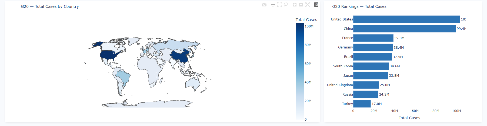
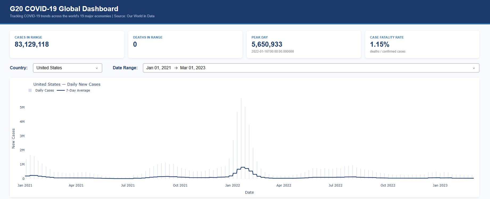
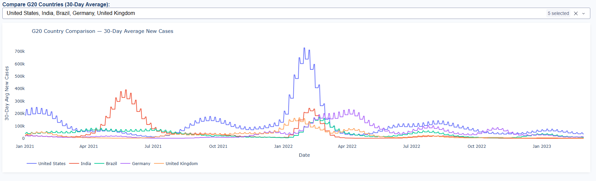

# G20 COVID-19 Global Dashboard

**Live Demo:** https://g20-covid-dashboard.onrender.com
> First load may take ~30 seconds (Render free tier cold start)

Interactive dashboard tracking COVID-19 trends across the G20 nations —
the 19 countries representing 85% of global GDP.

## Screenshots

### World Map — Total Cases by Country


### Country Time-Series with 7-Day Average


### G20 Country Comparison


## Why G20
G20 nations represent 85% of global GDP and every major continent.
This scope provides meaningful global comparison while keeping the
dataset fast (~26K rows) and the story focused.

## Features
- Country-level daily case and death trends
- 7-day rolling average time-series overlay
- World choropleth map colored by total cases
- G20 country rankings bar chart
- Multi-country 30-day comparison chart
- 4 KPI cards: cases, deaths, peak day, case fatality rate
- Date range filter

## SQL Highlights — Window Functions
```sql
-- 7-day rolling average per country
SELECT location, date, new_cases,
       AVG(new_cases) OVER (
           PARTITION BY location
           ORDER BY date
           ROWS BETWEEN 6 PRECEDING AND CURRENT ROW
       ) AS rolling_7day_avg
FROM covid_data;
```
See `queries.sql` for the full library, and `database.py` for the queries that
power the dashboard (`ROW_NUMBER`, `RANK`, `LAG`, `MAX`/`AVG OVER ... PARTITION BY`).

## Pipeline
> Note: The original OWID live endpoint retired in 2024. `enrich_db.py`
> backfills `iso_code`, `new_cases_smoothed`, and `population` from static
> constants and computed rolling averages. `data_fetch.py` is retained
> for documentation purposes only. Population figures are 2021 estimates —
> CFR (deaths/confirmed cases) is unaffected.

## How to Run Locally
```bash
git clone https://github.com/Kay-Lander/g20-covid-dashboard
cd g20-covid-dashboard

python -m venv venv
source venv/Scripts/activate    # Windows (Git Bash); use venv\Scripts\activate on cmd
# source venv/bin/activate      # macOS / Linux

pip install -r requirements.txt
python enrich_db.py    # re-derive enriched columns on data/covid.db
python app.py          # start dashboard at localhost:8050
```

## Tech Stack
Python | Dash | Plotly | pandas | SQLite | Gunicorn | Render

## Data Source
Our World in Data (OWID) — archived G20 dataset
2020–2024 | 19 countries | ~26,000 rows
